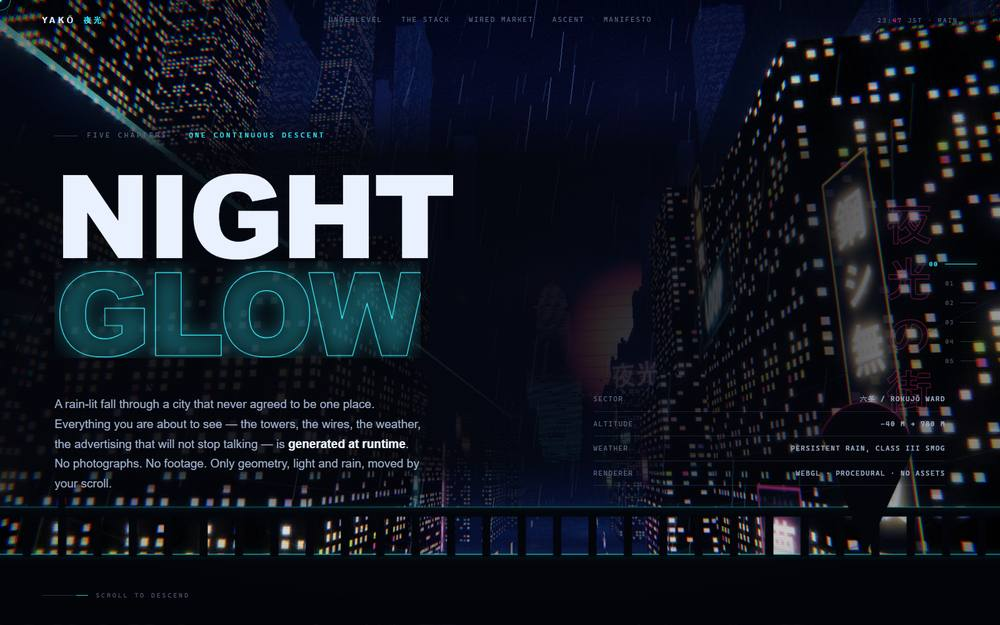
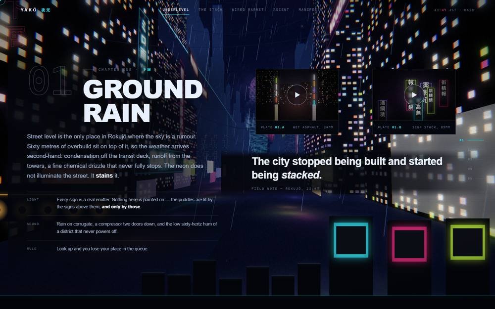
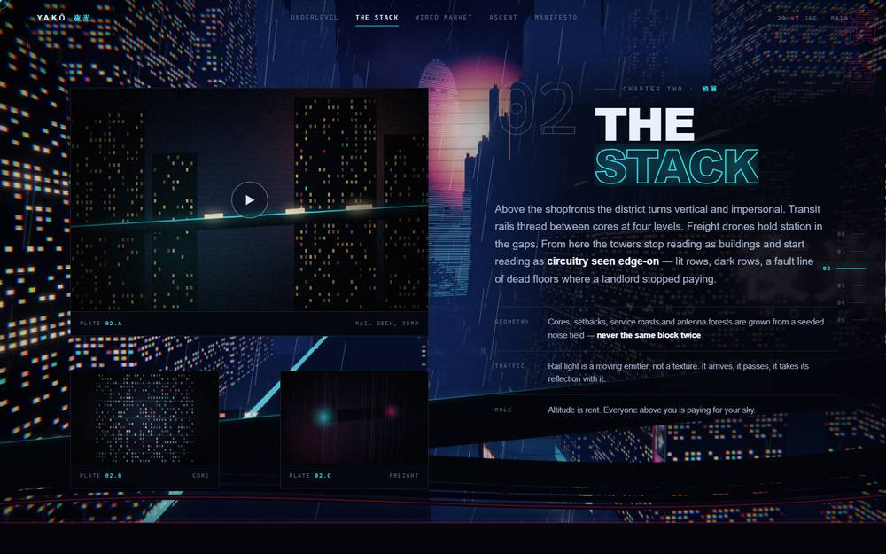
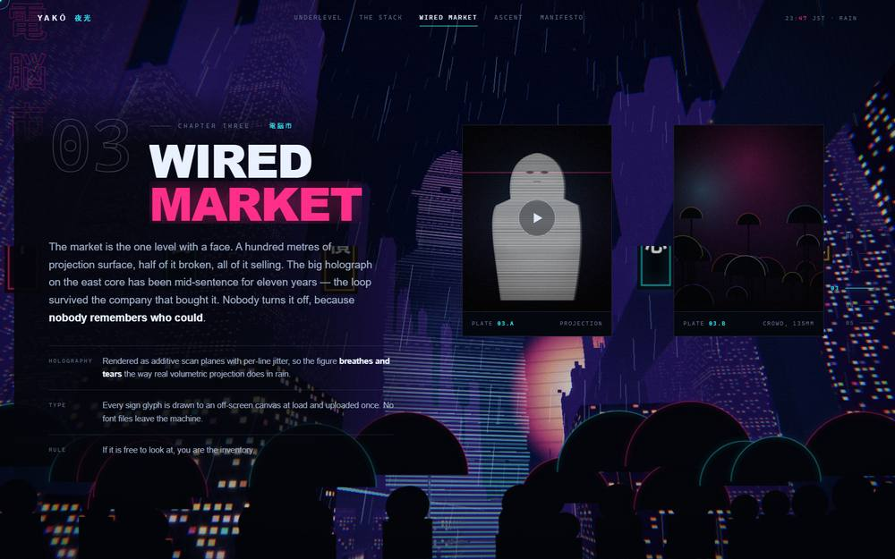
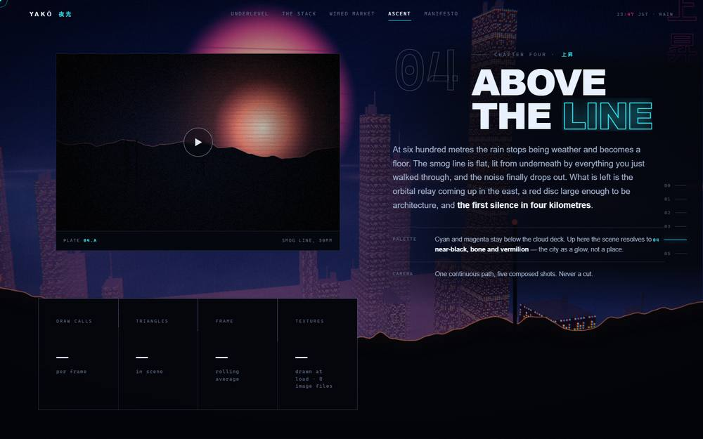
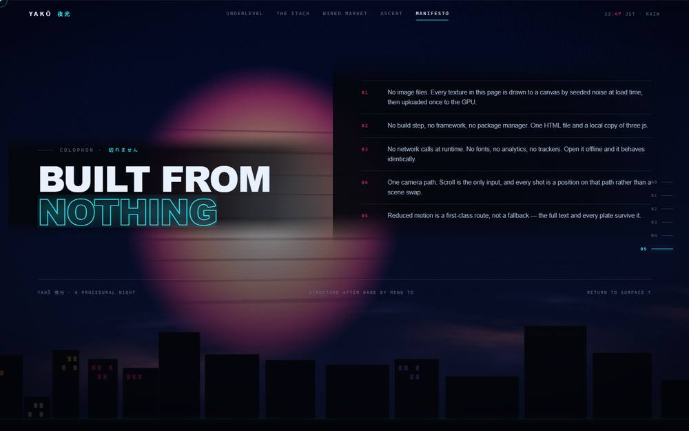

# YAKŌ 夜光

A single-page cinematic WebGL experience: a five-chapter night descent through
Rokujō Ward, a rain-lit megacity that only exists at runtime.

Scroll drives one continuous camera path from an elevated establishing shot down
to street level, up through the transit stack, past a broken hologram in the
wired market, and out above the smog line where the orbital relay is coming up.

**The page never loads an image.** Every façade, sign, puddle, cloud, projection
and foreground cutout is drawn to a `<canvas>` from seeded noise when the page
loads, then uploaded once to the GPU. The only file the page fetches is a local
copy of three.js. (The JPEGs in `assets/` are the social card and the stills
below — they live in the repository, not in the running page.)

## Running it

```bash
python -m http.server 4173 --directory .
```

Then open <http://127.0.0.1:4173>. Any static file server works. All paths are
relative, so it also runs unchanged from a repository subpath.

## Structure

```
YAKO/
├── index.html          the entire application — markup, CSS, and JS
├── PROMPT.md           the build specification
├── README.md
└── assets/
    ├── three.min.js    three.js r149 (MIT)
    ├── og.jpg          social card (never fetched by the page)
    └── preview/        the chapter stills used in this README
```

## The five chapters

Every frame below is the page itself, captured live — no compositing, no retouching.

### 00 · Night Glow


### 01 · Ground Rain
Street level, where the weather arrives second-hand and the neon stains the asphalt
rather than lighting it.


### 02 · The Stack
Along the transit deck, with the broken projection already glowing at the far end
of the canyon.


### 03 · Wired Market
The projection at full height, mid-tear. Sixty-four scan bands, each jittered
independently in the vertex shader.


### 04 · Above The Line
Six hundred metres up, where the rain stops being weather and becomes a floor.


### 05 · Manifesto


## What is generated

- **Façades** — six seeded window-grid textures with a matching emissive map, so
  lit windows are real emitters that bloom. Buildings are grown on a jittered
  block grid with setbacks, roof clutter, masts and aviation lamps, then merged
  into one mesh per façade texture.
- **Signs** — 96 vertical and horizontal signboards with kana/kanji/latin glyphs
  drawn at load, each with an additive glow card and a stretched smear on the wet
  asphalt below it. A fifth of them flicker.
- **Hologram** — 64 horizontal bands sampling a procedurally drawn figure, with
  per-band jitter, roll and burst tearing in the vertex shader. One draw call.
- **Weather** — 6,400 GPU-side rain segments that follow the camera and thin out
  with altitude, drifting embers, a billboarded sea of cloud, and a lit deck the
  towers pierce in chapter 04.
- **Post** — hand-rolled bright pass, two-level separable bloom, radial chromatic
  aberration, ACES tonemap, split-tone grade, scanlines, grain, vignette, and an
  occasional signal tear. No three.js example modules are used.
- **Foreground cutouts** — six silhouette layers (parapet, street clutter,
  girder, market banners, cloud bank, skyline) drawn to canvas and pinned while
  their chapter is active, then blurred away during the handoff.
- **Plates** — the eight "photographs" in the editorial columns are each painted
  at runtime the first time they approach the viewport.

## Notes

- No build step, no framework, no package manager, no analytics, no remote fonts.
- No network calls at runtime. It behaves identically offline.
- Reduced motion is a full route: time-based animation stops, the camera snaps
  per chapter instead of interpolating, and all copy and plates remain.
- `window.YAKO.jump(i)` parks the camera on chapter `i` and draws one frame —
  how the shots were composed.

Structure and editorial approach after [Kage](https://github.com/MengTo/kage) by
Meng To.
